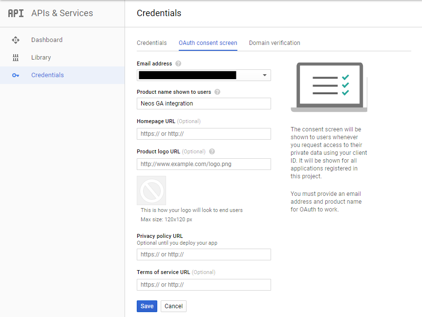
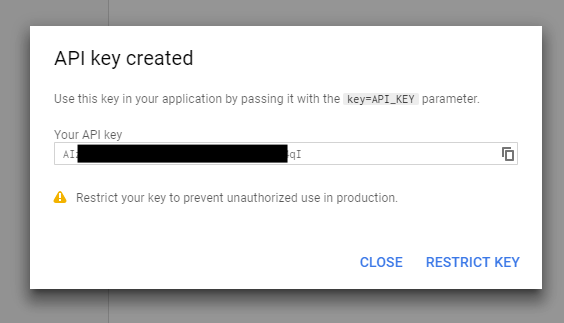
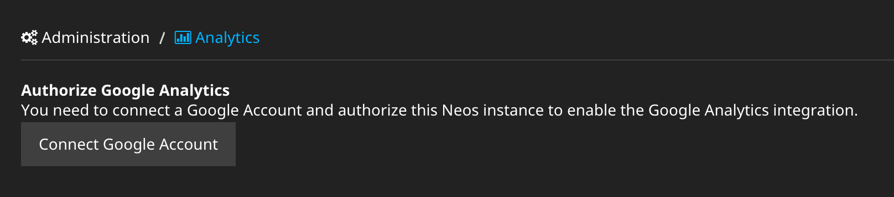
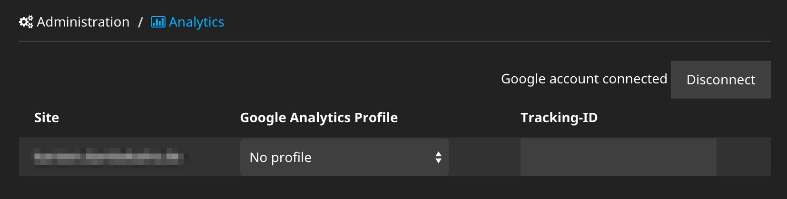

Neos Google Analytics |version| Documentation
=============================================

This is the documentation for the Google Analytics integration into Neos,
a free enterprise web content management system licensed under the GPL.

This version of the documentation covering |release| has been rendered at: |today|

Installation
------------

The package can be installed via composer::

  composer require neos/googleanalytics

Configuration
-------------

Statistics display inside Neos
^^^^^^^^^^^^^^^^^^^^^^^^^^^^^^

Configuration requires some setup on the side of Google, before the package can be used.
In a nutshell:

#. Log in to the Google Developers Console
#. Set up the Consent screen
#. Create a web application Client ID
#. Create a public access Server key
#. Enable the Analytics API
#. Configure the Google Analytics Neos integration using the created credentials
#. Connect Neos instance and Google Account

**The steps in detail**

Go to the `Google Developers Console <https://console.developers.google.com/>`_ and create
a project. This is needed to create the API credentials and keys for the Analytics
integration. The project name can be chosen freely and doesn't really matter, as you will
probably be the only one to ever see it.

.. image:: Images/google-developers-console-create-project.png

After the project has been created, you end up in the dashboard of the new project.

.. image:: Images/google-developers-console-project-dashboard.png

The next step is to set up the Consent screen. Click on *APIs & Services* and then *Credentials* > *OAuth consent screen*,
select an email address and fill in the product name. Again, this screen will probably only be
shown to you, so don't think too hard about it. All other values in the screen are optional.

Now you need to create credentials for the integration. To do this, click on *Credentials* in the
navigation, then *Create credentials* > "OAuth client ID*.

.. image:: Images/google-developers-console-credentials.png

Here you need to choose *Web application* and fill in the domain of your domain as *Authorized JavaScript origin* and must define an *Authorized redirect URI*.
It has to be your domain again, followed by::

  /neos/administration/googleAnalytics/authenticate.html

.. image:: Images/google-developers-console-client-id.png

Then click *Create*.

Back on credentials page you have to create a new public API access key by clicking on *Create credentials* > *Api key*.

.. image:: Images/google-developers-console-credentials.png

In the following dialog, click *Restrict key* to define allowed IP addresses, if you like. Otherwise click "Close".

Your credentials overview should now look like this:

.. image:: Images/google-developers-console-credentials-done.png

The last step in the Developers Console is to make sure the Google Analytics API is enabled.
Click on *Library* in the left navigation and enter "Analytics" in the search field.

.. image:: Images/google-developers-console-apis.png

Click on the Analytics API link and on the following page on Enable.

.. image:: Images/google-developers-console-enable-api.png

With the data from the credentials overview screen you can now configure the Neos
integration, just fill in the blanks:

.. code-block:: yaml

  Neos:
    GoogleAnalytics:
      authentication:
        # Application name for the consent screen
        applicationName: 'Neos GA'
        # "Client ID" of the OAuth 2.0 "Client ID for web application"
        clientId: ~
        # "Client Secret" of the OAuth 2.0 "Client ID for web application"
        clientSecret: ~
        # "API Key" of the Public API access credential "Key for server applications"
        developerKey: ~

Now go to the Analytics module in the Neos user interface.

.. image:: Images/neos-analytics-module.png

You will see a button to connect your Neos instance to a Google account.

Click it and you will be redirected to Google, showing you your consent screen and asking
for offline read access to Google Analytics data. Agree and you will be redirected back to
Neos:

Now the integration is set up to fetch data and display the Analytics statistics in the Neos
user interface.

Configure tracking
^^^^^^^^^^^^^^^^^^

To actually track visits with Google Analytics, some JavaScript with the tracking ID has to be
included in the markup. You can do this manually in your template, but the easier way is
to set up tracking for each site in the Analytics integration.

.. code-block:: yaml

  Neos:
    GoogleAnalytics:
      sites:
        ## All site specific settings are indexed by site node name
        neossitename:
          analytics:
            id: 'UA-XXXXX-YY'

Instead of using the Google Analytics tracking code, you can integrate the Google Tag Manager the same way:

.. code-block:: yaml

  Neos:
    GoogleAnalytics:
      sites:
        neossitename:
          tagManager:
            id: 'GTM-XXXXX'

.. note::
   If you configure both, a container and an Analytics ID, only the Tag Manager is included.

It is also possible to define default values for all sites. These will be merged with any site specific settings.

.. code-block:: yaml

  Neos:
    GoogleAnalytics:
      default:
        analytics:
          id: 'UA-XXXXX-YY'

Disable tracking
----------------

You can disable tracking for a site by either setting the  ``id `` to  ``false `` (this is the default value), or leaving it blank.

.. code-block:: yaml

  Neos:
    GoogleAnalytics:
      sites:
        neossitename:
          tagManager:
            id: false

Usage
-----

If Google has collected statistical data for your site, you will get the most
important data shown in an inspector tab for documents:

.. image:: Images/neos-analytics-inspector.png

Customizing metrics display
^^^^^^^^^^^^^^^^^^^^^^^^^^^

Its is possible to adjust the displayed metrics through configuration. The package
comes with preconfigured data, examine ``NodeTypes.yaml`` and ``Settings.yaml``.

Upgrade instructions (2.x -> 3.0.0)
^^^^^^^^^^^^^^^^^^^^^^^^^^^^^^^^^^^^

Configuration for the tracking code has been changed:

.. code-block:: yaml

  Neos:
    GoogleAnalytics:
      sites:
        neossitename:
          analytics:
            id: 'UA-XXXXX-YY'

``enableTracking`` setting
--------------------------

Tracking code is now only included if you provide either a container or an Analytics ID.
The ``enableTracking`` setting has therefore been removed.
