Neos Google Analytics |version| Documentation
=============================================

This is the documentation for the Google Analytics integration into Neos,
a free enterprise web content management system licensed under the GPL.

This version of the documentation covering |release| has been rendered at: |today|

Installation
------------

The package can be installed via composer in your site package::

  composer require --no-update neos/googleanalytics

Then run `composer update` in your projects root directory.

Configuration
-------------

Statistics display inside Neos
^^^^^^^^^^^^^^^^^^^^^^^^^^^^^^

Configuration requires some setup on the side of Google, before the package can be used.
In a nutshell:

#. Log in to the Google Developers Console
#. Create a service account key
#. Enable the Analytics API
#. Configure the Google Analytics Neos integration using the created credentials

**The steps in detail**

Go to the `Google Developers Console <https://console.developers.google.com/>`_ and create
a project. This is needed to create the API credentials and keys for the Analytics
integration. The project name can be chosen freely and doesn't really matter, as you will
probably be the only one to ever see it.

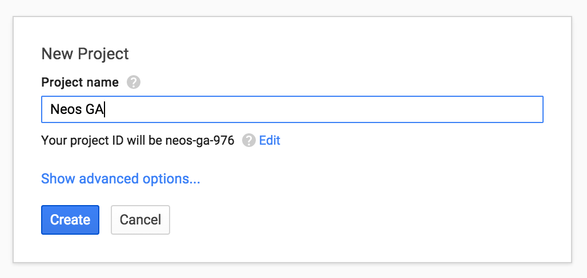

After the project has been created, you end up in the dashboard of the new project.

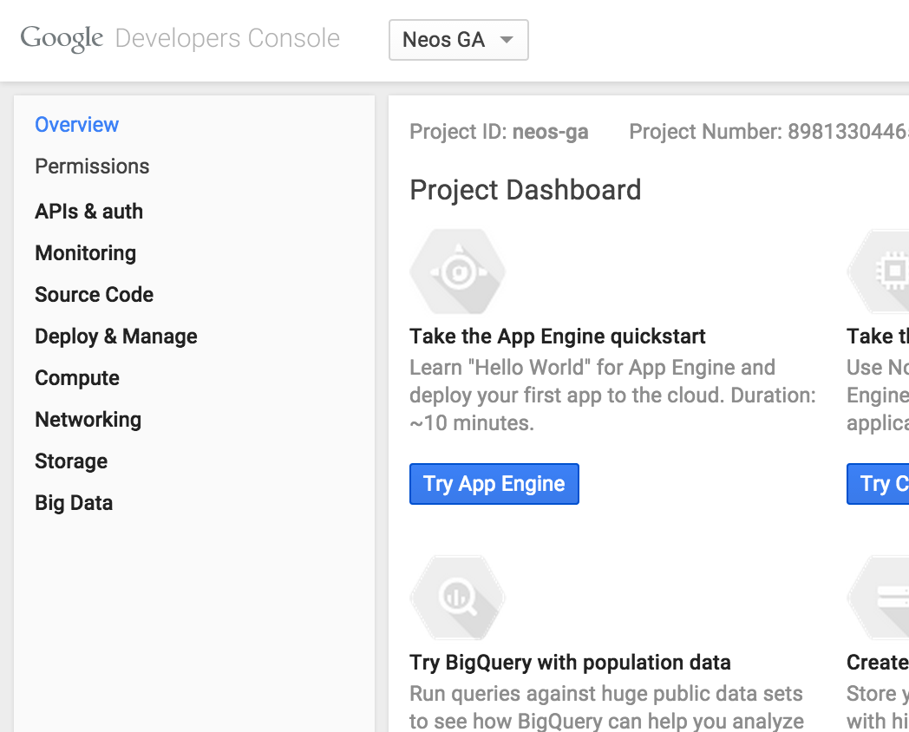

If you don't have one yet you have to create a new service account. For this go to "Service accounts" in the sidebar::

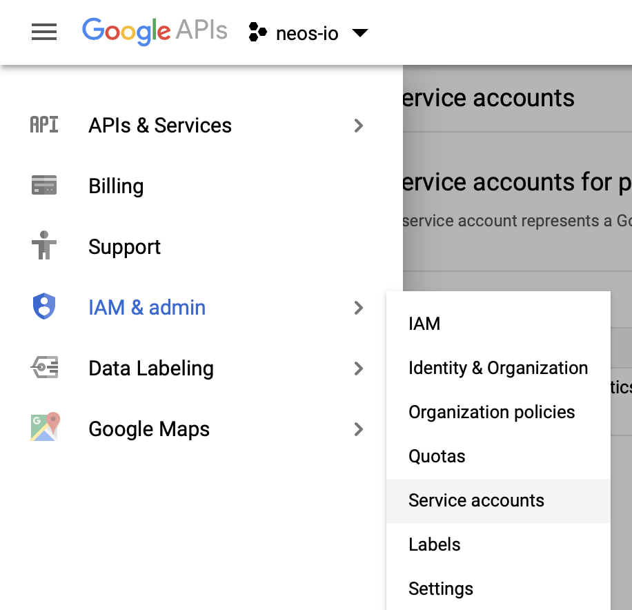

Now create a new one and fill out the required information::

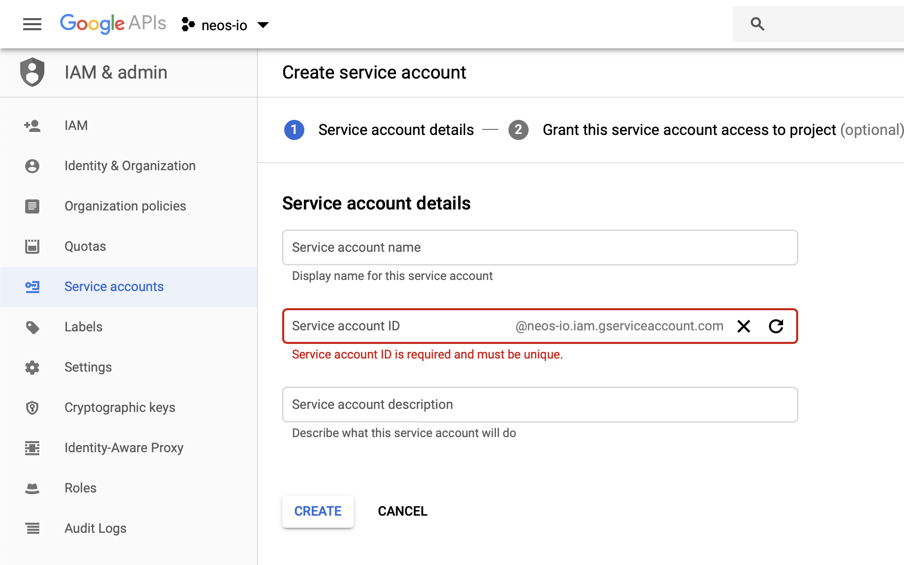

Now give the account the `Viewer` role for the project.

Now you need to create credentials for the integration. To do this, click on *Credentials* in the
navigation, then *Create credentials* > "Service account key*.

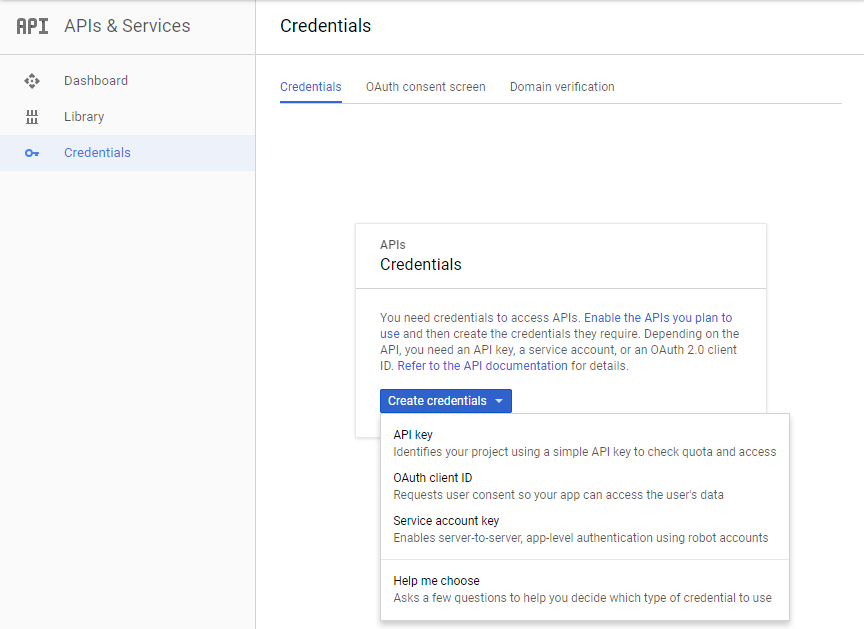

Here you need to choose your service account and select `json` as key type::

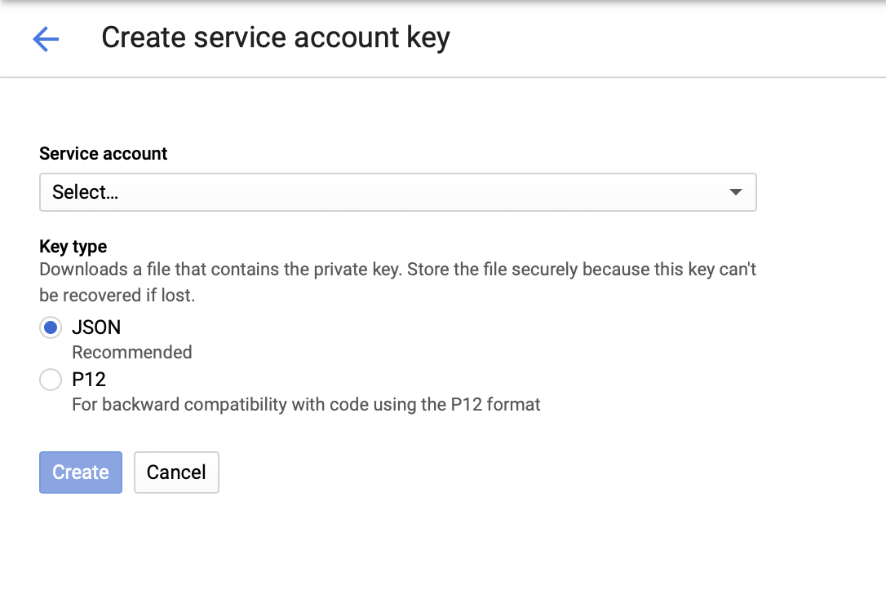

Then click *Create*. The download of your credentials file should start immediately.

Your credentials overview should now look like this:

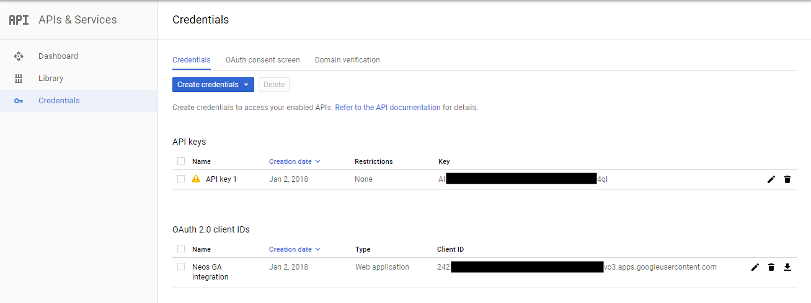

The last step in the Developers Console is to make sure the Google Analytics API is enabled.
Click on *Library* in the left navigation and enter "Analytics" in the search field.

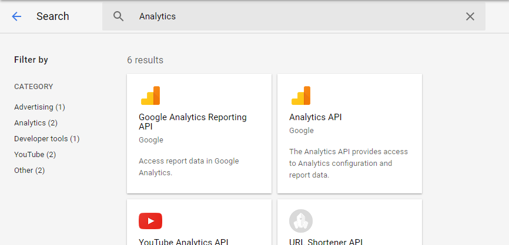

Click on the Analytics API link and on the following page on Enable.

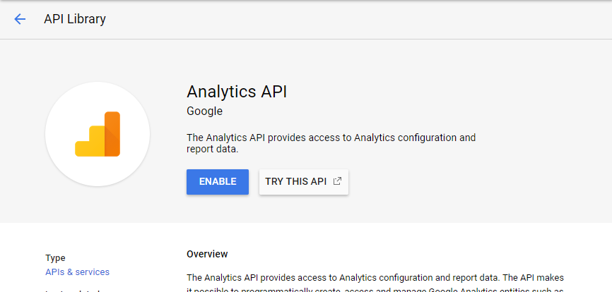

With the credentials file you downloaded you can now configure Neos.
You can either do this by storing the credentials in the persistent cache with the following command::

    flow googleapi:storecredentials my-credentials-file.json

Or you can set the environment variable `GOOGLE_APPLICATION_CREDENTIALS`
to the path where you store your credentials file.

Now go to the Analytics module in the Neos user interface and verify your setup.

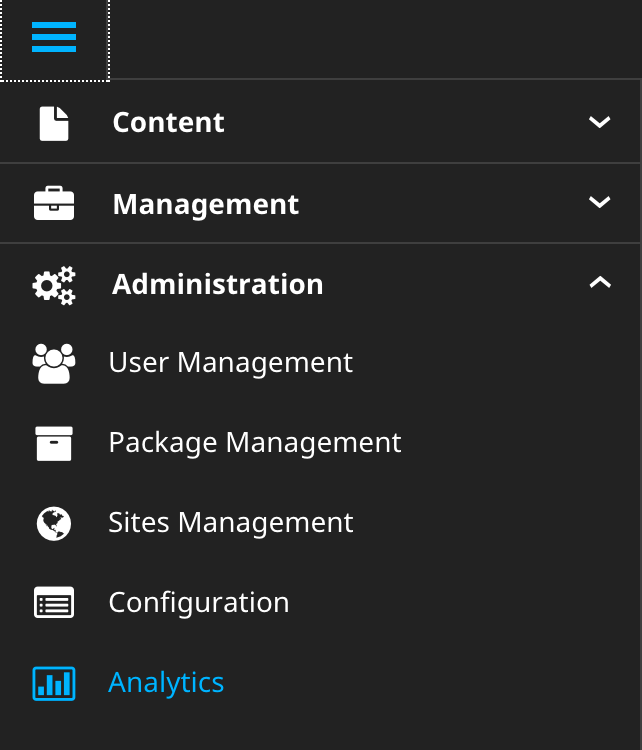

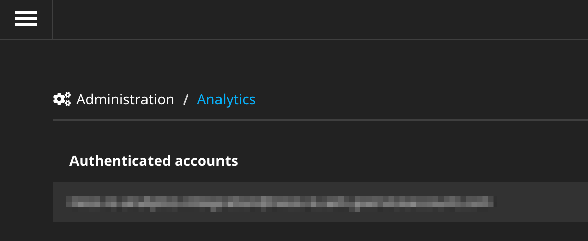

Now the integration is set up to fetch data and display the Analytics statistics in the Neos
user interface.

Configure tracking
^^^^^^^^^^^^^^^^^^

To actually track visits with Google Analytics, some JavaScript with the tracking ID has to be
included in the markup. You can do this manually in your template, but the easier way is
to set up tracking for each site in the Analytics integration.

.. code-block:: yaml

  Neos:
    GoogleAnalytics:
      sites:
        ## All site specific settings are indexed by site node name
        neossitename:
          analytics:
            id: 'UA-XXXXX-YY'

Instead of using the Google Analytics tracking code, you can integrate the Google Tag Manager the same way:

.. code-block:: yaml

  Neos:
    GoogleAnalytics:
      sites:
        neossitename:
          tagManager:
            id: 'GTM-XXXXX'

.. note::
   If you configure both, a container and an Analytics ID, only the Tag Manager is included.

It is also possible to define default values for all sites. These will be merged with any site specific settings.

.. code-block:: yaml

  Neos:
    GoogleAnalytics:
      default:
        analytics:
          id: 'UA-XXXXX-YY'

The analytics backend module will also give you and overview of all configured sites and their ids.

Disable tracking
----------------

You can disable tracking for a site by either setting the  ``id `` to  ``false `` (this is the default value), or leaving it blank.

.. code-block:: yaml

  Neos:
    GoogleAnalytics:
      sites:
        neossitename:
          tagManager:
            id: false

Usage
-----

If Google has collected statistical data for your site, you will get the most
important data shown in an inspector tab for documents:

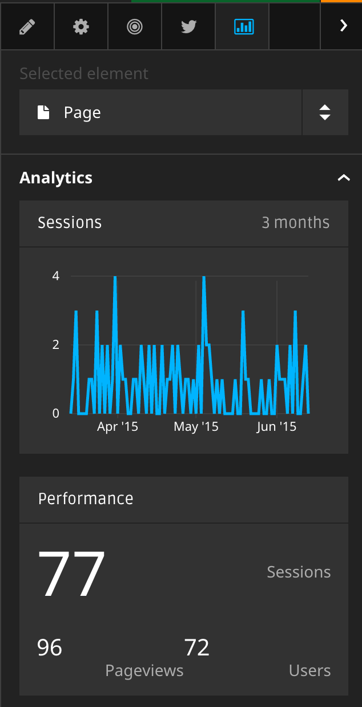

Customizing metrics display
^^^^^^^^^^^^^^^^^^^^^^^^^^^

Its is possible to adjust the displayed metrics through configuration. The package
comes with preconfigured data, examine ``NodeTypes.yaml`` and ``Settings.yaml``.

Upgrade instructions (2.x -> 3.0.0)
^^^^^^^^^^^^^^^^^^^^^^^^^^^^^^^^^^^^

Configuration for the tracking code has been changed:

.. code-block:: yaml

  Neos:
    GoogleAnalytics:
      sites:
        neossitename:
          analytics:
            id: 'UA-XXXXX-YY'

``enableTracking`` setting
--------------------------

Tracking code is now only included if you provide either a container or an Analytics ID.
The ``enableTracking`` setting has therefore been removed.

Authentication with the Google API
----------------------------------

The OAuth authentication in the older version of this package was often unreliable and caused many issues.

Therefore you now need to create a service account and matching credentials. See the `Configuration` chapter above.
